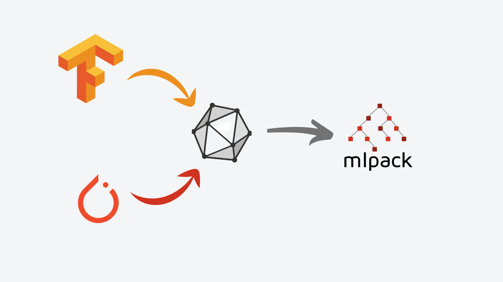

# ONNX-mlpack Translator

  
   
  <h2>Unlock the Power of Other Frameworks in mlpack</h2>

This repository contains a converter for certain machine learning models from
onnx to mlpack format. Currently this repository is still under construction
and might undergo some major refactoring, please use with cautios.

### The repository is in developing phase and its been tested on the following models.

| Models              | Graph Generation | Weight Transfer |
| ------------------- | ---------------- | --------------- |
| mobileNet           | ✔️               | ✔️              |
| yolo-tiny v2        | ✔️               | ✔️              |
| Iris classification | ✔️               | ✔️              |

## ONNX-mlpack Repository Setup Guide:

### Prerequisites

1. **mlpack Installation:**
    - Ensure that mlpack is installed on your local system. Follow the [official mlpack build instructions](https://github.com/mlpack/mlpack#:~:text=3.%20Installing%20and%20using%20mlpack%20in%20C%2B%2B) to complete this step.
    
1. **ONNX Installation:**
    - If you don't have Protobuf installed, ONNX will internally download and build Protobuf during its build process. You only need to build ONNX. Refer to the [official ONNX build instructions](https://github.com/onnx/onnx#:~:text=conda%2Dforge%20onnx-,Build%20ONNX%20from%20Source,-Before%20building%20from) for more details.
    - However, to avoid potential version issues in the future, we have provided a zipped format of ONNX in the `build_onnx` repository along with a script that will directly install ONNX on your system.
    - 
follow the below instruction to build onnx and make the repository running:

### Steps to Build ONNX

1. **Clone the Repository:**
    - Clone the `onnx-mlpack` repository to your local system and navigate to the repository directory.
    
2. **Build ONNX:**
    - Run the following commands to build ONNX:
        `chmod +x run.sh` 
	    `./run.sh`
        
    - This will generate all the necessary build files for ONNX inside the `build_onnx` folder.
    
3. **Verify mlpack and ONNX Build:**
    - With both ONNX and mlpack built, it's time to test the setup with an example repository.

### Running the Example Repository

1. Go to the `example/iris-classification` folder.
    
2. In the Makefile, update the mlpack header path to match your mlpack build path. For example:
      `-I/home/your_username/mlpack/build/installdir/include`
        
3. Run the make command and check the console output to verify that everything is working correctly.
   If everythig goes fine you can similarly run the other example as well.

