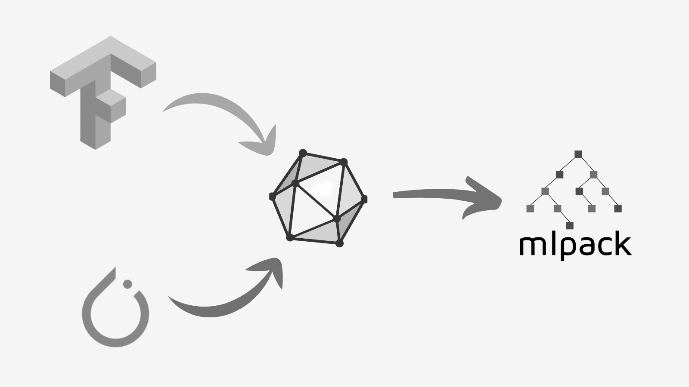

# ONNX-mlpack Translator

<div align="center">
  <a href="http://mlpack.org">
    
  </a>
  <br>
</div>

The ONNX-mlpack converter can take any ONNX graph and convert it to an mlpack
neural network.  This is done by matching individual mlpack layers to subgraphs
of the ONNX network using a rule matching engine, and then selecting the overall
best match of the network.

## Setup

1. Dependencies: make sure that you have, available on your system,
 - [mlpack](https://www.mlpack.org) and its dependencies
   [ensmallen](https://www.ensmallen.org),
   [cereal](https://github.com/USCILab/cereal), and
   Armadillo](https://arma.sourceforge.net); if not installed, these will be
   autodownloaded during the CMake comnfiguration
 - ONNX (on Debian, `libonnx-dev` is sufficient)
 - Protobuf (on Debian, `libprotobuf-dev` is sufficient)

2. Configuration: create a build directory and use CMake to configure:

```sh
mkdir build/
cd build/
cmake ../
```

3. Build the converter:

```sh
make onnx_mlpack_converter
```

4. Run the converter:

```sh
src/onnx_mlpack_converter <input_network.onnx> <output_mlpack_network.bin>
```

Once the converter has been run, you can load the network into mlpack as a
`DAGNetwork`:

```c++
#define MLPACK_ENABLE_ANN_SERIALIZATION
#include <mlpack.hpp>

using namespace mlpack;

int main()
{
  DAGNetwork<> network;
  Load("output_mlpack_network.bin", network);

  // now you can use network.Predict(), network.Train(), etc.
}
```

## Notes

This repository is under active development!  At this particular moment, support
is pretty primitive, but it is actively being expanded.  If you have a network
that does not match properly, or encounter other problems, please feel free to
open a bug report and we will look into the issue.
